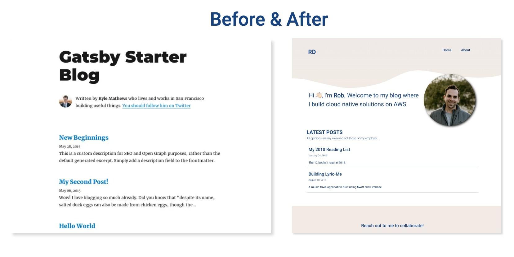
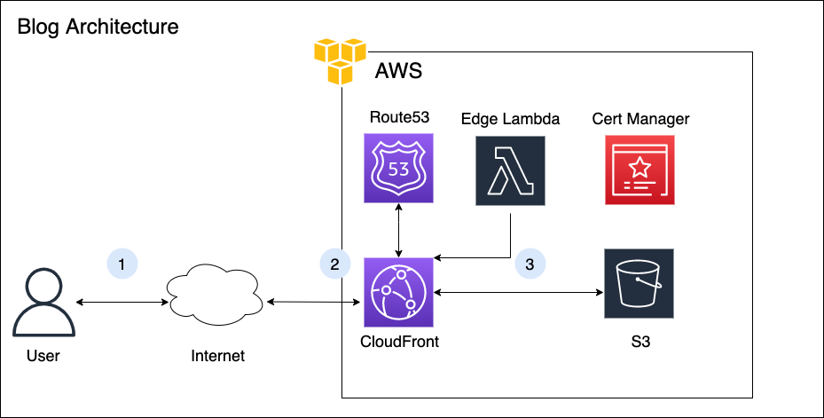
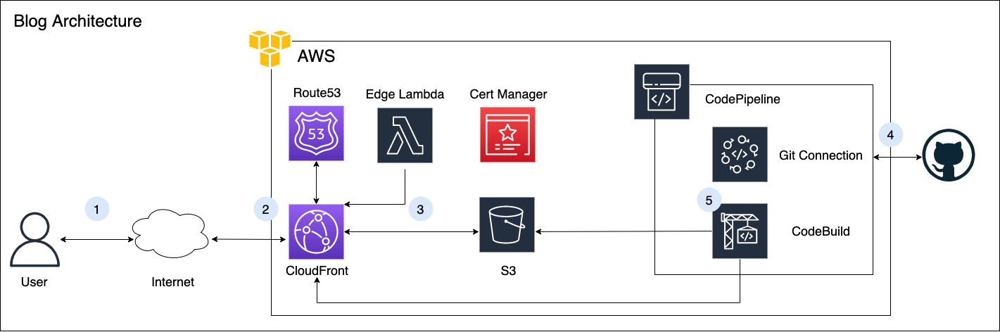
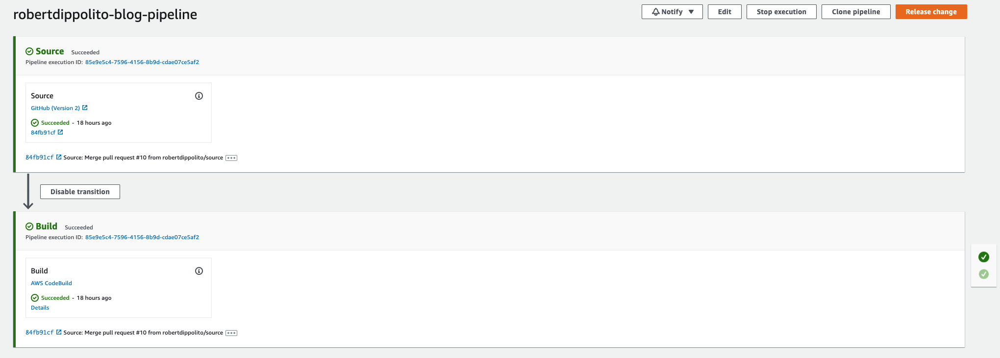
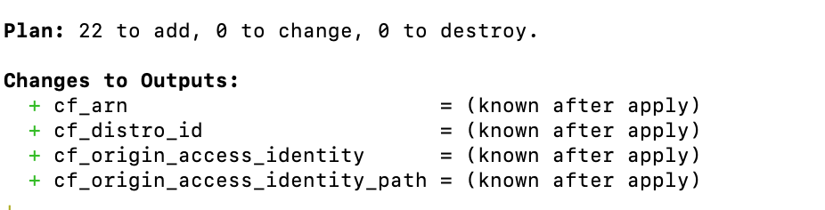
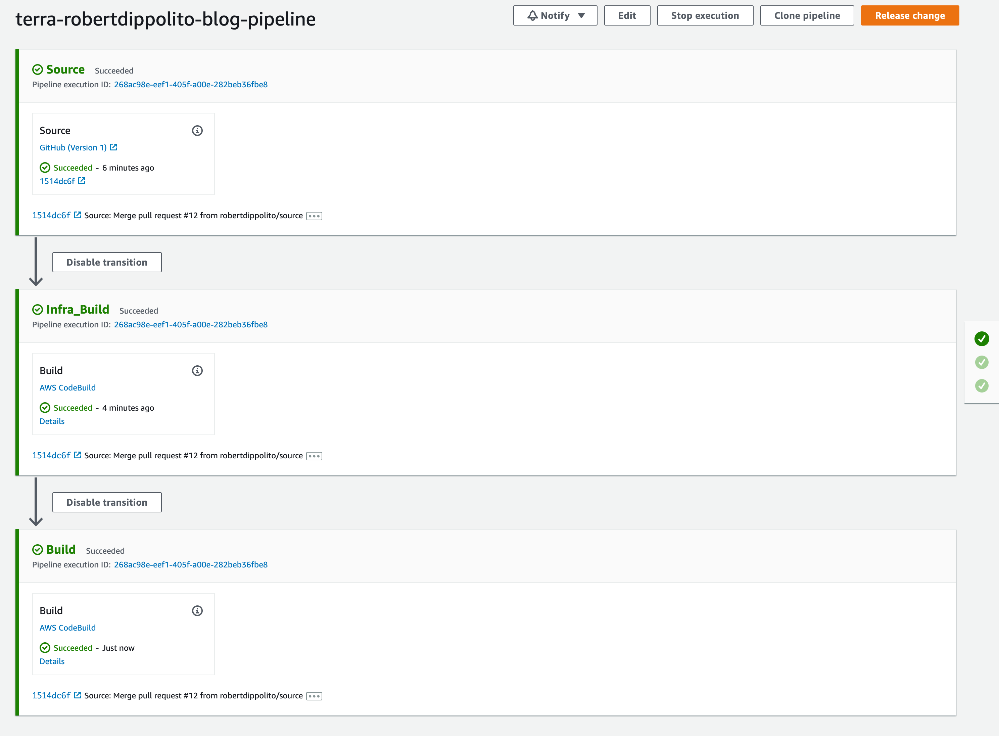
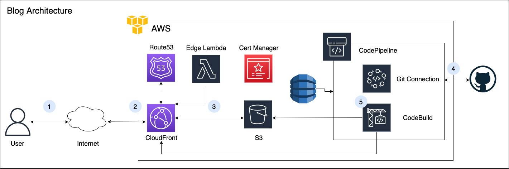

The goal of this post is to showcase the importance of DevOps and the impact it can have on ability for development teams to deliver quality software. In this blog post I will detail the phases involved in building
out this blog, a simple static web page where I can write blog posts in markdown (a lightweight markup language). I will tell the story in phases with each phase improving the overall experience for the developer or development team. The phases will 
display the evolution of the application with the ultimate goal of a __1-click-deploy__ that should automatically deploy both application and infrastructure changes.


## Phase 1: Creating the Frontend

The blog was created using [Gatsby](https://www.gatsbyjs.com/), a flexible frontend Javascript framework that is based off of React. I like Gatsby because it has a-lot of prebuilt plugins that can be included via configuration to make it a-lot faster
to build web applications. I used [gatsby-starter-blog](https://www.gatsbyjs.com/starters/gatsbyjs/gatsby-starter-blog) as my foundation. I wanted something that was lightweight and offered an easy way to write blog posts. This template checked both boxes.



The building of the webpage was fairly straightforward. I needed to add a navigation bar, re-write the main page and update the footer. The blog post preview and delivery mechanism largely stayed the same. I also populated some of my previous posts
that were previously posted on [Medium](https://medium.com/@robert.e.dippolito) to add some content while I tested. 

## Phase 2: Deploying the Site

As I mentioned in the introduction I chose to deploy the application using a very common server-less configuration consisting of a content delivery network (CDN), a data store for static files, and DNS for routing traffic. On AWS this translates to a Cloudfront distribution (CDN), S3 for static file store and Route53 for DNS. The diagram below describes how these components work together to load content into your browser when you navigate to my website url.



1. A user will attempt to hit https://robertdippolito.me from their browser over the internet.
2. The request for the domain robertdippolito.me actually references the Cloudfront distribution which has an Amazon provided domain name (typically somestring.cloudfront.net). This is where DNS helps us bridge the gap and route the traffic to our cloudfront. We use cloudfront here to a) optimize the performance of our website and b) to protect the contents of our S3 bucket by ensuring they are only accessible behind the Cloudfront. Content delivery networks leverage a global network of 'edge' locations that store the website files so they can be retrieved over a shorter distance and provide less latency. For example - if your files are stored in Canada and someone wants to access your website from Australia - instead of requesting and waiting for your files all the way from Canada every time you want to access; the site files are temporarily stored (cached) in an edge location closer to Australia reducing the distance between the user and the files thus reducing latency.
3. Once Cloudfront receives the request it knows to pull the appropriate files from the S3 bucket and return it to the user (in this case our index.html file)

### Deploying the Infrastructure

In order to get these services up and running we need to go into the AWS console and create an S3 bucket, configure and deploy a CloudFront distribution, and configure a hosted zone in Route53. The following steps assume you have a domain name. These can be purchased by providers such as [GoDaddy](https://www.godaddy.com/en-ca) & [Namecheap](https://www.namecheap.com) or directly in the AWS console in the Route 53 Dashboard (Route53 -> Registered domains -> Register Domain).
1. Prior to starting we will need to configure our DNS. To do this we will need a domain name and an AWS managed certificate.
   - To request an AWS managed certificate navigate to AWS Certificate Manager and select the Request option.
   - The certificate type should be a public certificate 
   - Enter your domain name (in my case robertdippolito.me) and select DNS or email validation and select Request.
   - This request typically takes between 40 mins to a few hours. Once completed the status of your certificate should display issued.
2. Next we will need to configure a new hosted zone.
   - Navigate to Route 53 and select Hosted Zones then Create hosted zone
   - Depending on where your purchased your domain you will need to set up your name server (NS) and start of authority (SOA) records. Your provider will likely have detailed instructions on how to do this and is outside the scope of this post.
   - We also need to create an alias (A) record to give Cloudfront the instruction to route traffic coming to robertdippolito.me to our CloudFront distribution (note you will need your CloudFront distribution's Domain for this step).
3. To start we will first create an S3 bucket. The name of the bucket must be unique but and we also want to make sure that public access to the bucket is restricted.
4. Next, we will setup the CloudFront. To do this navigate to the CloudFront page and select create distribution.
   - Add the origin name as the S3 bucket we created in the previous step
   - Add the origin path to be 'public/'. I will explain this when we upload our site files into the bucket.
   - Use origin access identity (OAI) to restrict access to our bucket files. Create a new OAI and make sure to select 'Yes, update the bucket policy' with the OAI.
   - Origin shield can be left disabled and the default cache behaviour, cache key & origin requests, and function associations can be left with the default options.
   - In settings make sure to select our custom ssl certificate from the drop down (note the certificate will only show up if your certificate is issued). This will ensure we can securely connect to our website via https instead of http.
   - In settings set the alternate domain name to the site you wish to route your traffic to (in my case robertdippolito.me)
   - Create the distribution
5. Once the steps above are completed our infrastructure is setup. However, all requests bound for our domain are routing to our CloudFront, and per our configuration, our CDN will return the index.html file that doesn't exist. This will result in an access denied page returned from S3 because we are requesting a file that does not exist. To fix this we need to upload our site files to S3.
   - In order to upload our files we first need to package them and create a production ready optimized build. To learn more about the Gatsby build process check out this [link](https://www.gatsbyjs.com/docs/conceptual/overview-of-the-gatsby-build-process/). Once we build the files a production ready set of files is created in the /public directory of our working directory.
   - We will now upload the public folder directly into our created S3 bucket via the S3 console. Once completed we should be able to navigate to our domain (https://robertdippolito.me) and we should see our webpage.

>__Amazing, we are live!__ All of that work but we deployed a static website on AWS. While this is great it was also a-lot of work for something that is pretty simple. Not only that but we did everything manually, nothing was recorded and don't look now but someone just found a typo on our website. Now what?

## Phase 3: Automating our Deployment

Despite being live we still have a few problems to solve - the first one being the most pressing. We have a small change we need to make on our website. In order to do that I would need to load up our site locally, fix the typo, rebuild the website and upload the public/ folder back to my S3 bucket. Finally I would need to invalidate the cache (stored files) that exist on all of the edge locations of my CloudFront. Not a huge deal but the problem compounds when the issue is bigger then a typo or if I am not the only developer working on the code base. In that scenario how do we make sure that the code deployed is the latest? How can we ensure the code I am re-uploading is not conflicting with another team member's changes?

To tackle these problems we are going to introduce a pipeline that is integrated with our code repository. This will eliminate the need for manually uploading files when things are changed and automate the infrastructure behind updating site files. To do this we will need to use a pipeline and build service. AWS provides an end to end suite of code deployment tools - for this post we will be using [CodePipeline](https://aws.amazon.com/codepipeline/) and [CodeBuild](https://aws.amazon.com/codebuild/). Introducing these services expands our architecture slightly.



In our new architecture we've introduced our version control system (in this case GitHub but many alternatives exist including AWS provided solutions like CodeCommit). With these additional components the goal is to automatically push approved changes to our site with minimal human interaction. Taking into account the steps above we need to automatically pull the latest code from our version control system, build the site, copy the files from the public folder to our S3 bucket and invalidate our CloudFront. To do this we need to configure a CodePipeline that will connect to our version control system of choice and a CodeBuild job that will build the code, copy it to S3 and invalidate our cloudfront cache.

For the purposes of the post I will assume some familiarity with git and version control tools. For those unfamiliar feel free to read up [here](https://en.wikipedia.org/wiki/GitHub).
 
1. To start we will need to create the build job
   - Navigate to the codebuild console and select new project. Each time we run our pipeline AWS will generate a container (think of this as an isolated operating system) that can do some defined tasks for us before shutting down. In this case the manual steps we defined above.
   - Provide a project name and description and select S3 as the source provider.
   - The bucket name should be the name of the artifact store we will create in the next step.
   - For the environment we will use a managed image using Ubuntu (we do this because support for Node14 which is what our code is running on is not supported by the provided images) with a standard run time - either image will be suitable.
   - We will then add a [buildspec](https://github.com/robertdippolito/robertdippolito.github.io/blob/source/devops/codebuild/buildspec.yaml) file that will allow us to print out instructions for the build phase. In this case we want to build the site files, copy the files into S3 and invalidate our cloudfront.
```yaml
version: 0.2
phases:
  install:
    runtime-versions:
      nodejs: 14
    commands:
      - npm install -g gatsby

  pre_build:
    commands:
      - echo Show working directory
      - ls
      - echo Installing source NPM dependencies.
      - npm install
  build:
    commands:
      - echo Build started on 'date'
      - npm run build
  post_build:
    commands:
      - aws s3 rm --recursive s3://${static-web}/public
      - aws s3 cp --recursive ./public s3://${static-web}/public
      - > 
        aws s3 cp 
        --cache-control="max-age=0, no-cache, no-store, must-revalidate"
        ./public/index.html s3://${static-web}/public
      - >
        aws cloudfront create-invalidation --distribution-id ${cf-distribution}
        --paths "/public"
artifacts:
  files:
    - '**/*'
  base-directory: public
```
2. Next we will create a pipeline for our build job. To do so navigate to CodePipeline and select create. 
   - Provide a pipeline name and create a new service linked role.
   - For the source stage we will want to select GitHub as our source provider and go through the steps to connect to our repo. Select the option to start the pipeline on source code change
   - For the build stage build provider select Codebuild and select the job we created
   - Because our deploy is technically when new files are uploaded we do not need a deploy stage.
   - Review and create.

Now that we have completed the steps above we should have an automated pipeline. Which means every-time we push code to our specified branch (in our case deploy) our pipeline will trigger. To control what is actually getting deployed we would set up our repository in such a way that we would restrict pushing directly to deploy as this could break something if its not reviewed by another developer. This doesn't have to be the case but introduces a control plane that gives us more control over what goes into production. If we had automated tests we wouldn't need such a control.



> Now every-time we push code to our deploy branch our changes will automatically be deployed and reflected on our site! Now any changes small or big can be quickly dealt with! But lets say we want to make a small change to our infrastructure? Or we are working in a development team and someone updates our CloudFront or DNS without our knowledge and brings our site down? There is no way for us to know what happened unless we dig through CloudTrail logs and even then we might not find an answer.

## Phase 4: Automating our Infrastructure Deployment

The next logical step on our path to automated deployments is to automate the deployment of our infrastructure (in this case our cloudfront, route 53 config, s3 bucket, codepipeline and codedeploy). Once again, there are many tools that can do this (AWS has several including CloudFormation and CDK). For this post I have decided to use [Terraform](https://www.terraform.io/), an open-source infrastructure as code tool that abstracts the AWS (and other major cloud providers) API into a __declarative__ configuration file. It's important that it is declarative because that will help solve the problem we are currently facing. 

As we codify our infrastructure we need to split it out into its components. I won't be going into the details of each configuration file because the code is available [on the repo](https://github.com/robertdippolito/robertdippolito.github.io/tree/source/devops/terraform) but I will cover the process of creating the files. We first need to layout the components of the infrastructure as we documented in the last step and then populate the configuration details. Once completed we extract important variables (like our bucket names, environment, etc.) and put them in a variables file. Terraform is smart enough to handle most of the dependencies (i.e. if we need to create the S3 bucket before the cloudfront it will do that), however, in some cases we need to be explicit. For example, typically CloudFront takes a bit of time to deploy and as a result could cause some issues with our pipeline standup so we can use the _depends_on_ flag in our resource template.



We have now created our infrastructure as code and when we attempt to apply it via _terraform apply_ we will create 22 new resources (our cloudfront, route 53, s3 bucket, codepipeline, codedeploy and all of the roles and policies necessary to create our desired configuration). Once we apply this infrastructure terraform will monitor and report on any changes each time an apply attempt is triggered. Now if we want to change a configuration on our cloudfront or someone from our team changes how our S3 bucket is configured from the console we can track the change and easily solve the problem. __We are very close to our 1-click deploy solution__. The final step is to add our terraform deployment as a build stage in our pipeline. Its fine that our initial deploy worked but any subsequent changes to the infrastructure need to be tracked and applied. To do this we need to create a new build stage and corresponding buildspec.
```yaml
version: 0.2
env:
    parameter-store:
      GITHUB_SECRET: github-repo-key
phases:
  install:
    commands:
      - "apt install unzip -y"
      - "wget https://releases.hashicorp.com/terraform/${TF_VERSION}/terraform_${TF_VERSION}_linux_amd64.zip"
      - "unzip terraform_${TF_VERSION}_linux_amd64.zip"
      - "mv terraform /usr/local/bin/"
  pre_build:
    commands:
      - ls
      - cd "${TF_SRC_DIR}"
      - ls
      - terraform init -input=false
  build:
    commands:
      - terraform plan -var="github_token=${GITHUB_SECRET}" -lock=false
      - echo "GITHUB_SECRET"
      - terraform ${TF_ACTION} -var="github_token=${GITHUB_SECRET}" -input=false -auto-approve -lock=false

  post_build:
    commands:
      - echo "Terraform completed on `date`"

artifacts:
  files:
    - '**/*'
```

We will want to follow a similar pattern for deploying as we did for our initial stage and simply run a terraform apply to deploy the infrastructure.

We want to implement a simple pipeline that will install terraform and apply our prescribed infrastructure. This will also allow us to have a completely declarative infrastructure that is completely managed in code.

This will leave us with a multi-stage pipeline that will deploy our infrastructure and then our application code. Now if a change is made to our code by a developer in the console that brings down our application we can simply run our pipeline and our entire infrastructure will be provisioned.



A key step in this process is changing the backend of our terraform state. Throughout this process we have been working locally and as a result our terraform state has been saved locally. This is fine as a solo project, however, we are going to be sharing this project and state with our pipelines. As such, we need a means of sharing this state remotely. Luckily terraform allows us to configure a remote state natively in AWS using S3 and DynamoDB.

```json
terraform {
  backend "s3" {
    encrypt = true
    bucket = "terraform-blog-state-rob-blog"
    dynamodb_table = "terraform-state-lock-dynamo"
      key = "blog/terraform.tfstate"
      region = "ca-central-1"
  }
}
```

Once configured, our state file (which represent the current state of infrastructure) is shared remotely. This is helpful for 2 reasons: 
1. it allows our pipelines to check-in on the current state before running our entire build and just pick up the deltas and
2. it will lock the state to make sure that changes to the state are not being modified at the same time by two different developers.

Now if we are in the situation where a developer updates our infrastructure or we need to make a configuration change to our code we can simply update the appropriate modules in our devops folder. Let's say for example our security advisor lets us know that our current security policy (TLSv1.2_2018) is no longer meeting our security requirements and we need to move to TLSv1.2_2019. To make this change we would simply navigate to our cloudfront terraform script and update the [protocol version](https://github.com/robertdippolito/robertdippolito.github.io/pull/14) and commit the code. Our system would take those changes and update the infrastructure automatically. No console access required. Completely declared and tracked in source control. __Safe__.

## Phase 5: Removing Manual Gates

We've done a-lot but there is always room for improvement. While I will not go into it in this post we can still do more. In our system we currently have a manual gate (merging to the deploy branch) and while it is not a hard gate (I could very easily push changes directly to deploy) it is one that can be removed. To do so we would need to add tests to our system. Tests (when written correctly) removes the need to review before introducing code into productive environments. Additionally, our pipeline takes about 5 minutes to complete. This can be  improved (we are installing terraform and gatsby every-time we execute our pipeline). We can create specific images that have these tools pre-installed to ensure that our pipeline is not wasting time installing libraries redundantly. With our remote backend added our final architecture can be seen below.



## Conclusion

>With this final milestone we have achieved our goal of a 1-click blog deploy. Phases 3 and 4 took longer than phases 1 and 2. If you are a solo developer working on a personal blog you probably don't need to care much about phases 3 and 4. However, if you are business competing in a competitive market phases 3 and 4 can make the difference between success and failure. The ability to keep engineers focused on building products that people love and value for their business through automating their workflows as much as possible is incredibly important.

I enjoyed writing this post and I am very happy that I have the blog up and running. I will be doing my best to update the blog with new posts as much as I can throughout 2022. If you found this interesting or useful please let me know and if you have feedback on anything I've done please reach out and share. Helpful links below:

[Blog Repo](https://github.com/robertdippolito/robertdippolito.github.io)

[Gatsby Blog Template](https://www.gatsbyjs.com/starters/gatsbyjs/gatsby-starter-blog)


