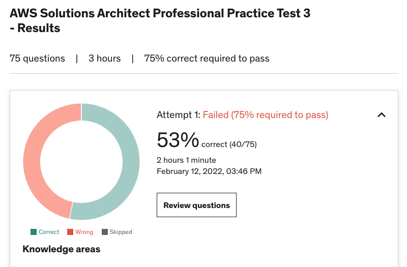

On May 6th 2022, I successfully completed the AWS Certified Solution Architect Professional Exam. I got my solution architect associate certification 2 years ago as a member of the Accenture Liquid Studio. Since then, I’ve had my eye on the professional certificate. It is one of 12 certifications and in my opinion the one that evaluates your knowledge of AWS holistically. After achieving my associate and with 3 years of hands on AWS experience under my belt, I felt like I was ready to write the exam.

### The Challenge

The [AWS Professional Certificate](https://aws.amazon.com/certification/certified-solutions-architect-professional/?ch=tile&tile=getstarted) is 75 questions covering all AWS services across 4 major areas (design for organizational complexity, design for new solutions, migration planning, cost control and continuous improvement). The exam is 3 hours long and all multiple choice. The preparation and execution of the test took 4 months. The preparation was made up of online courses, group study, practical application, and lots of practice problems. 

[__A Cloud Guru:__](https://acloudguru.com/) A Cloud Guru is an online certification prep platform. They offer courses targeted for each certification that are made up of tutorial videos and practice problems. I went through the professional prep course (videos and quizzes). 

__Group Study:__ About a month or so into the prep I started having weekly sessions with a colleague twice a week. These sessions would typically be between 30 minutes to an hour and would cover; a) questions we had from our independent studying b) interesting things we learned or facts to remember. I also wrote all of my notes in a notebook as I found this helped me retain more information.

__Application:__ While studying I created this [blog](https://robertdippolito.me/building-the-blog/) and did some hands on work with Cognito. The hands on experience gets you the working level experience that some of the questions on the exam look for.

__Practice tests:__ I bought test packages from [Udemy](https://www.udemy.com/course/aws-solutions-architect-professional-practice-exams-amazon/learn/quiz/4478590/results?expanded=667593978#overview), and [Whizlabs](https://www.whizlabs.com/learn/course/aws-solutions-architect-professional/). Udemy included 4 tests and Whizlab contained 5 full tests, a diagnostic test and 5 subject specific 10 question tests. The practice tests were a critical tool for studying and were the basis for a majority of studying. I would say that the Udemy tests were better in overall quality (explaining concepts etc.), but Whizlab was more difficult and (in my opinion) more representative of the exam.

### The Good

- __Group study__ provded to be incredibly important. Having the ability to bounce ideas off of someone frequently was not only good from a knowledge sharing perspective, but it also kept the motivation high. Comparing practice exam scores was also a good gauge of how we were progressing.
- __Practice tests__ with quality explanations. After writing a test you get access to the correct answers with an explanation. These explanation helped point you in the direction of resources and gave you the opportunity to patch up that area of understanding.
- __Consistency__ was key and practice really does make perfect. In the last two weeks leading up to the exam, I did 10-20 practice questions per day in sets of 10 questions. After each 10, I would review my answers and write (in a notebook) what I got wrong and why it was wrong. 

### The Bad 

- __Test fatigue__. Writing a 75 question test and then reviewing the questions you got wrong was hard and took atleast 5 hours. I would not recommend practicing full tests until you are close to writing it and purely from a time management perspective. I found doing 10-20 questions much more manageable and productive on a daily basis.

- Very __specific questions__. Some questions will ask very specific details about a service. For example: what Blockchain frameworks does AWS Managed Blockchain support? I don't think the point of the exam should be that you know each service inside and out, but that you understand the general concepts that the exam is testing you on (i.e. design for org complexity, migrations, new solutions, cost control and continuous improvement). That being said, there weren't many questions in both practice and the actual exam, however, it was frustrating to come across them as you're put in a situation where you need to essentially pick the best guess.

### The Ugly
The certification is difficult. I've worked deeply in many areas across AWS (networking, serverless, data, telephony), but there are over 200 features supported by AWS and there will always be something new to learn. This definitley was reflected when taking practice tests on specific topics where I would score between 4/10 to my peak of 6/10. Getting these scores only a few weeks out from the exam date, with 3 months of studying under my belt was definitely demoralizing and I did question whether I was ready for the exam or if I should reschedule. At the end of the day, getting questions wrong is often more helpful then getting them right, as you retain more information by reading the explanations.

### Conclusion & Advice

I am really happy to have passed and I would not have been able to do so without my study partner, so thank you! This was definitely a challenging exam. I think there are definitely some areas of AWS that you should have hands-on experience with, namely: VPC and network design, serverless (API Gateway, Lambda, Dynamo DB) and CloudWatch/Trail. Certain services come up more frequently then others, so having theoretical knowledge about them is generally helpful (SQS, SSM, OpsWork, RDS). I don’t think the exam is passable without hands on experience with AWS, I think it is a good barometer of your AWS competency and I am really happy with the end to end experience. I think throughout the course of prepping for this course I further strengthed my skills as an AWS solution architect. I don’t know if another certification is in my future, but if it were to be one it would probably be the Devops professional.

