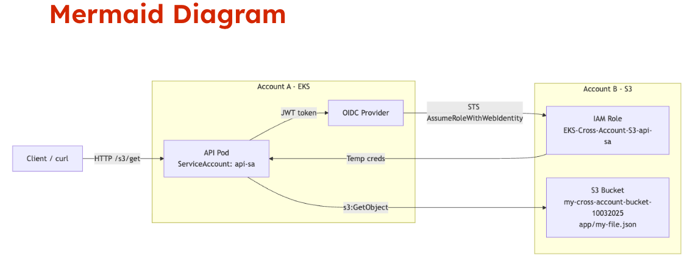
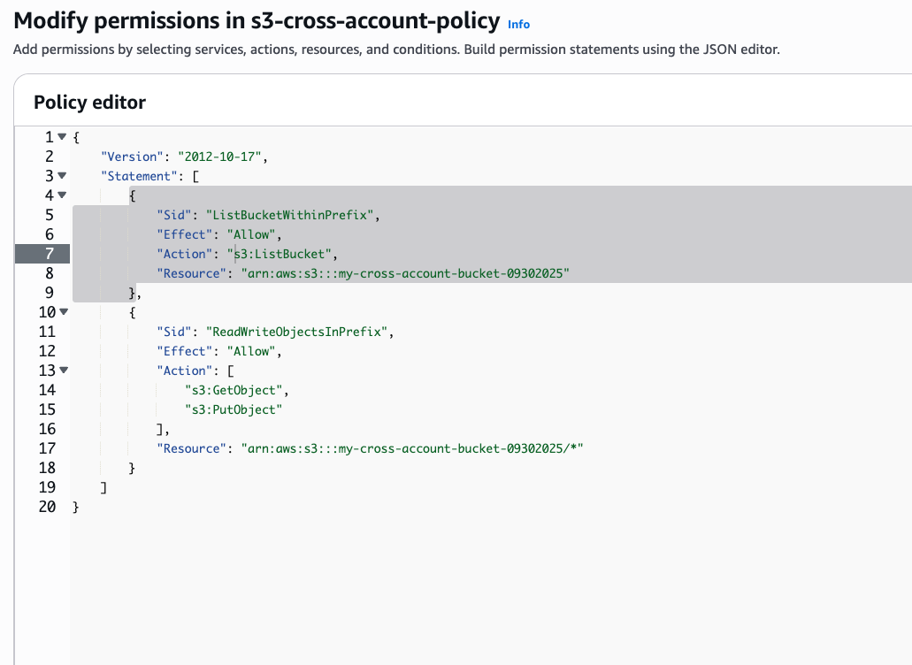
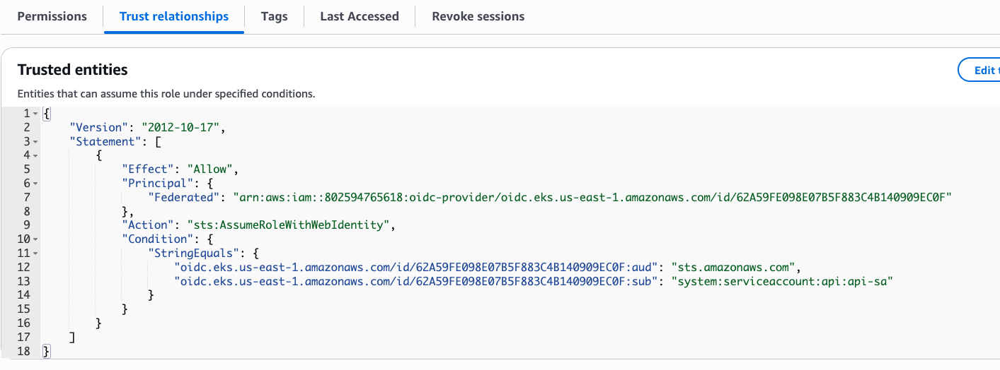

This post summarizes my YouTube demo where an EKS pod in Account A reads an object from an S3 bucket in Account B—without hard-coded access keys. Below you’ll find the why, the architecture, the minimal Terraform/Kubernetes you need, a tiny API snippet, and a quick “what can go wrong” checklist.

## TL;DR

- Use IAM Roles for Service Accounts (IRSA) so pods can assume an IAM role via STS using short-lived credentials.
- Create an S3 bucket plus cross-account IAM role in Account B that trusts the OIDC provider from the EKS cluster in Account A (scoped to a single service account).
- Annotate your Kubernetes `ServiceAccount` in Account A with the role ARN from Account B.
- Your pod now calls S3 with no static keys; AWS injects short-lived credentials under the hood.

The learnings from this video are captured on my [Youtube](https://www.youtube.com/@RobOps101) channel and specifically in the video below:

<iframe width="560" height="315" src="https://www.youtube.com/embed/1P0nCvpzx1E?si=a6bjnKr6m9E3vlH6" title="YouTube video player" frameborder="0" allow="accelerometer; autoplay; clipboard-write; encrypted-media; gyroscope; picture-in-picture; web-share" referrerpolicy="strict-origin-when-cross-origin" allowfullscreen></iframe>

## Why IRSA for Cross-Account?

In real environments, you often split concerns: platform/EKS in one account, shared data (like analytics or reference data) in another. Hard-coding access keys “works” but creates secret sprawl and long-lived credentials.

IRSA flips that on its head:

- No secrets to manage: creds are minted on demand by STS.
- Least privilege: scope down to a single service account and a narrow S3 policy.
- Short-lived: automatic credential rotation reduces blast radius.

## Architecture at a Glance

- **Account A**: EKS cluster runs API pods using a Kubernetes `ServiceAccount` named `api-sa`.
- **Account B**: S3 bucket holds a JSON file; an IAM role (for example, `s3-reader-role`) trusts the OIDC identity from the EKS cluster in Account A and grants read-only S3 permissions.
- **Flow**: the pod calls the API → API SDK hits S3 → the SDK fetches a projected OIDC token from the pod → STS validates the token → issues temporary creds for the Account B role → `GetObject` succeeds.



## Account B: Bucket + Cross-Account Role (Terraform)

Below is a minimal sketch you can adapt. It creates:

- an S3 bucket
- a read policy scoped to that bucket

- an IAM role that trusts the EKS OIDC provider from Account A and only for `system:serviceaccount:default:api-sa`


Replace placeholders such as `${var.account_b_id}`, `${var.oidc_provider_arn_from_account_a}`, and bucket names to match your setup.

```terraform
# variables you’ll provide (via tfvars or otherwise)
variable "account_b_id" {}
variable "bucket_name" {}
variable "oidc_provider_arn_from_account_a" {}
variable "eks_oidc_issuer_url_without_https" {} # e.g. oidc.eks.us-east-1.amazonaws.com/id/EXAMPLED841

resource "aws_s3_bucket" "cross_account_data" {
  bucket        = var.bucket_name
  force_destroy = false
}

data "aws_iam_policy_document" "s3_readonly" {
  statement {
    sid     = "AllowReadObjects"
    actions = ["s3:GetObject", "s3:ListBucket"]
    resources = [
      aws_s3_bucket.cross_account_data.arn,
      "${aws_s3_bucket.cross_account_data.arn}/*"
    ]
  }
}

resource "aws_iam_policy" "s3_readonly" {
  name   = "s3-readonly-${var.bucket_name}"
  policy = data.aws_iam_policy_document.s3_readonly.json
}

# Trust policy for IRSA from Account A’s EKS OIDC provider
data "aws_iam_policy_document" "irsa_trust" {
  statement {
    actions = ["sts:AssumeRoleWithWebIdentity"]
    effect  = "Allow"
    principals {
      type        = "Federated"
      identifiers = [var.oidc_provider_arn_from_account_a]
    }
    condition {
      test     = "StringEquals"
      variable = "${var.eks_oidc_issuer_url_without_https}:sub"
      values   = ["system:serviceaccount:default:api-sa"]
    }
    condition {
      test     = "StringEquals"
      variable = "${var.eks_oidc_issuer_url_without_https}:aud"
      values   = ["sts.amazonaws.com"]
    }
  }
}

resource "aws_iam_role" "s3_reader_role" {
  name               = "s3-reader-role"
  assume_role_policy = data.aws_iam_policy_document.irsa_trust.json
}

resource "aws_iam_role_policy_attachment" "attach_s3_readonly" {
  role       = aws_iam_role.s3_reader_role.name
  policy_arn = aws_iam_policy.s3_readonly.arn
}
```

> You don’t need a bucket policy unless you already have explicit deny statements or want to constrain things further. The role’s identity-based policy is sufficient for typical `GetObject` access.

## Account A: Annotate the ServiceAccount

Annotate the service account with the Account B role ARN. Your deployment should use this service account.

```yaml
apiVersion: v1
kind: ServiceAccount
metadata:
  name: api-sa
  namespace: default
  annotations:
    eks.amazonaws.com/role-arn: arn:aws:iam::<ACCOUNT_B_ID>:role/s3-reader-role
```

Apply it, then ensure your Deployment uses `serviceAccountName: api-sa`:

```yaml
apiVersion: apps/v1
kind: Deployment
metadata:
  name: api
spec:
  replicas: 2
  selector:
    matchLabels:
      app: api
  template:
    metadata:
      labels:
        app: api
    spec:
      serviceAccountName: api-sa
      containers:
        - name: api
          image: yourrepo/yourimage:tag
          env:
            - name: BUCKET_NAME
              value: your-cross-account-bucket
```

Roll it out:

```bash
kubectl apply -f serviceaccount.yaml
kubectl apply -f deployment.yaml
kubectl rollout status deploy/api
```

## API: A Minimal `/s3/{key}` Endpoint (Go)

With IRSA in place, the AWS SDK will source temporary credentials transparently. You only need the bucket name—no keys.

```go
// go.mod should use AWS SDK for Go v2
// require (
//   github.com/aws/aws-sdk-go-v2 vX
// )

package handlers

import (
  "context"
  "io"
  "net/http"
  "os"

  "github.com/aws/aws-sdk-go-v2/aws"
  "github.com/aws/aws-sdk-go-v2/config"
  "github.com/aws/aws-sdk-go-v2/service/s3"
  "github.com/gorilla/mux"
)

func GetS3Object(w http.ResponseWriter, r *http.Request) {
  key := mux.Vars(r)["key"]
  bucket := os.Getenv("BUCKET_NAME")
  if bucket == "" || key == "" {
    http.Error(w, "missing bucket or key", http.StatusBadRequest)
    return
  }

  ctx := context.Background()
  cfg, err := config.LoadDefaultConfig(ctx)
  if err != nil {
    http.Error(w, "config error", http.StatusInternalServerError)
    return
  }

  client := s3.NewFromConfig(cfg)
  out, err := client.GetObject(ctx, &s3.GetObjectInput{
    Bucket: aws.String(bucket),
    Key:    aws.String(key),
  })
  if err != nil {
    http.Error(w, err.Error(), http.StatusBadGateway)
    return
  }
  defer out.Body.Close()

  w.Header().Set("Content-Type", "application/octet-stream")
  io.Copy(w, out.Body)
}
```

## Test the Endpoint

Run the curl command and you should see the object stream back from Account B:

```bash
curl -s http://<your-api>/s3/config.json
```

## Demo Recap

- **Provision**: Terraform creates the bucket and an IAM role in Account B that trusts Account A’s EKS OIDC provider and only your `api-sa`.
- **Annotate**: Kubernetes service account in Account A points at that role ARN.
- **Run**: The pod calls S3; STS issues temporary credentials; the request succeeds with no static keys stored in code or cluster secrets.

## Common Gotchas (Checklist)

- **OIDC issuer mismatch**: The issuer URL in your trust policy must match the EKS cluster’s issuer exactly (and the trust condition uses the version without `https://` as shown above).
- **Wrong sub or namespace**: `system:serviceaccount:<namespace>:<name>` must match your `ServiceAccount` precisely. If you move namespaces later, update the trust policy.
- **Wrong audience**: Keep `aud: sts.amazonaws.com` in the trust policy conditions.
- **Missing serviceAccountName**: Your Deployment must use the annotated service account; otherwise IRSA won’t attach.
- **Explicit bucket deny**: If you have a bucket policy with deny statements, ensure it doesn’t block your role. Identity policy alone is typically enough unless you’ve hardened the bucket with denies.
- **Local testing confusion**: Locally you might have credentials in `~/.aws`. In-cluster, rely on IRSA; avoid shipping fallback environment variables that reintroduce static keys.

## Wrap-Up

That’s the full path to give an EKS pod in Account A scoped, temporary access to an S3 bucket in Account B using IRSA + STS—no long-lived credentials, and clean blast-radius boundaries. If you’re building multi-account architectures, this pattern should be your default for AWS API access from pods.

If this helped, the full walkthrough is in the video—likes/subscribes always appreciated. And if you try this pattern, tell me what you scoped in your role and whether you needed any special bucket policy constraints.
