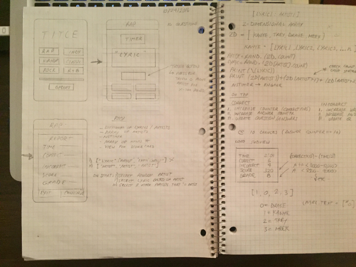

Over the last 5 months I built a mobile application from scratch called Lyric-Me. Lyric-Me is a musician based trivia application that curates quizzes based on fun and interesting facts from an array of genres and artists that changes daily. The idea for the application was born from my addiction to Genius.com, an online media knowledge base that curates facts and trivia about artists and relates them to specific lyrics. I felt like it created an entirely new layer of engagement and brought more depth and personality to artist’s music. This in combination with the fact that I compulsively follow interesting facts and trivia accounts on Instagram contributed to the birth of an idea that eventually turned into Lyric-Me.

## Trust the Process

Lyric-Me started as a nameless paragraph scribbled into a notebook back in October. Working full time and being in front of a computer screen for most of my day made it difficult to allocate time to Lyric-Me during the week. That meant that most of my Saturday’s were dedicated to coding. Lyric-Me was also the first app that I’ve coded completely in Swift 3 so things inevitably got off to a rocky start — but my motivation was peaking, so I was still trending in a positive direction.

Before I started building, I wanted to call out specific features that I wanted to build out and ideally stick to those features to avoid any type of scope creep. From the paper scribbles, I settled on the main features of the app:

- The application should be able to generate quizzes based on the user’s genre selection.
- The solution should be able to read music trivia from a database and display them on the screen along with four artists.
- Gamify the quizzes (ultimately deciding that trophies would be the best option).

Armed with a handful of features and a couple pages of notes I got to work.

### Version 1.0 — The First Cut

The first version of Lyric-Me took a little under 6 weeks / Saturdays to scrape together. Version 1.0 had a static quiz list which meant adding and removing quizzes would require a code change, the trophy view was working but had no content, and there were no meaningful settings options. But it worked!

For the next week I proudly showed off my creation to my friends and let them in on the next viral app a little early. The feedback from everyone was positive but I could tell that the application was really lacking the ‘WOW’ factor that I was hoping for. The UI was weird (“why do you have the title written three times?”), the quizzes were too broad (“What type of artists are in the rock quiz?”) and the incentive to keep playing just wasn’t there (“That was fun, but now what?”). These along with others were all valid comments I would need to address if I wanted Lyric-Me to work as intended. This meant I needed to go back to the drawing board. Humbled and armed with some key concerns, I set out to launch Lyric-Me 2.0.

### Building Stuff 101

Keeping focused on Lyric-Me after version 1.0 was tough. Once I shared 1.0 with my friends, the initial allure and mystery of the first impression wore off and I was left with an idea that had some major flaws and a half-baked code base. At this point it was hard to stay motivated and some Saturdays I wouldn’t even open up my laptop.

I’ve been fortunate enough to be surrounded by a lot of intelligent and dedicated people. Whether I was studying with them in school, working with them in my full time job or just talking over coffee. One thing I’ve noticed about all of them is that they are ‘do-ers’ and they finish the things they start. Anyone can scrap together an app that demo’s a cool API but it takes a do-er to take that idea and turn it into something substantial. The saying “Innovation is rewarded, but execution is worshiped” resonates a lot. Not with just side projects but with life. The world values do-ers and giving up on Lyric-Me at version 1.0, well, I wasn’t going to let that happen.

### Version 2.0 — Lets Get Down to Business!

With this second wind, I got down to business busting bugs and improving the code quality. The biggest functional change being that I allowed all of the quizzes to be dynamically managed from the database enabling a ton of flexibility with the quizzes that could be sent to users. I overhauled the UI and finished the app (trophies / settings / quizzes). At this point I was ready for my second round of feedback, but this time, I wanted a bigger sample size. I decided I would reach out to my extended network and sent Lyric-Me to 40 external testers.

The feedback that came in from version 2.0 was more positive and constructive which was reassuring. I grouped the feedback into three different buckets quick fix items, must fix items and nice-to-haves. Some of the feedback I received requested net new features that would take hours of rework. This is where having my scope set really helped; I kept the feedback but saved those features for a later date. Overall, the feedback was more positive for version 2.0 but the application wasn’t ready yet.

### Version 3.0 — The Final Cut

The feeling you get when you are closing out a side project that you’ve spent a lot of time on is pure excitement. Its comparable to the feeling I got when I showed version 1.0 to my friends, except this time, the application is a fully functional product that you are confident people will enjoy. The journey to 3.0 wasn’t an easy one and it took a lot of time and commitment. By no means is Lyric-Me coded to the standard and quality of a Pokemon GO or some of the professionally developed applications that are dominating the app store but it is an application that represents my style, interests and passion for development. Its a project that I am proud of and something that at the very least will help improve my musical trivia. Version 3.0 worked out a lot of the issues regarding the general feel of the app. “The colours are too masculine” and “I don’t know whether I got an answer right or wrong during a quiz” was common feedback across several testers. I worked to improve how the app felt in the users hand and made sure the experience was obvious and enjoyable. I’m happy with the final result. Today, Lyric-Me is available for free in the iOS app store. I’d love to hear what you think!

### Whats Next?

I plan on continuing to develop features for Lyric-Me. One of the common pieces of feedback was to be able to challenge friends to trivia matches. I’ve started building out that feature and I’m having a lot of fun with it. I also have a few smaller side projects on the go which I’d like to start dedicating more time to. Lyric-Me will be my second iOS app in the app store and definitely the best. The amount of learning that took place over the 5 months was invaluable and I am excited to continue improving my ability to build products that people will truly enjoy and grow as a technology professional. My advice to anyone on the fence about trying something new or who have a side project that got shot down at first. Finish it! Be a do-er and bring your idea into the universe. You will learn a ton and have a feeling of victory that you were able to do it. Its the feeling that I have right now as I type this and trust me, its worth it.