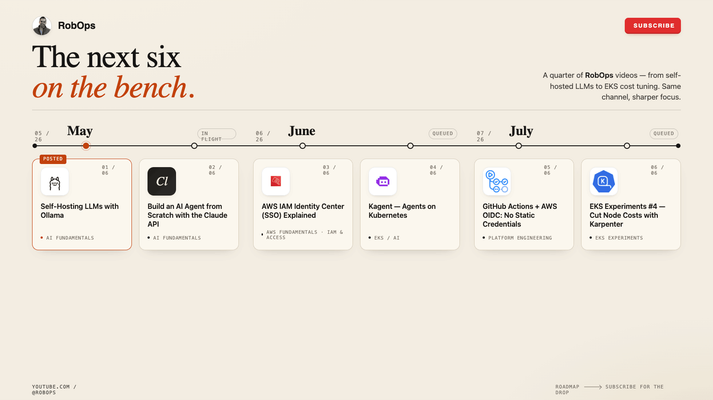
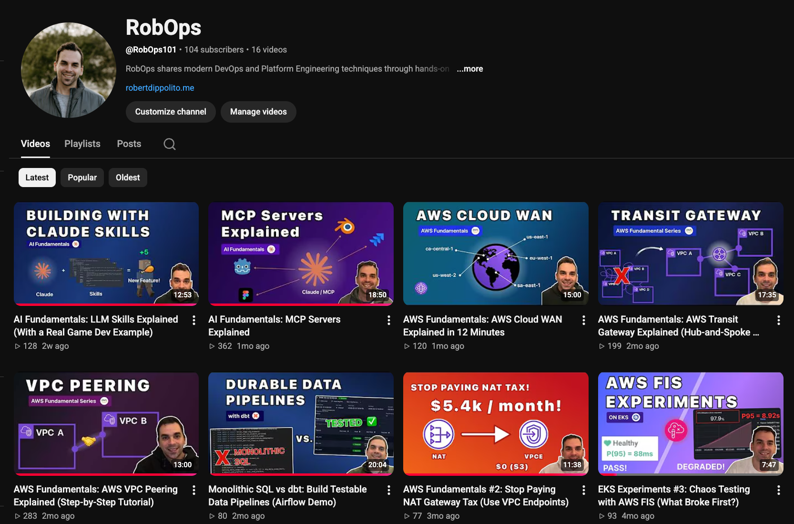

Throughout my career I have always been interested in the challenges, trends, and solutions that face our industry. As an engineering manager my role is often a mix between coordinating teams delivering programs across cross functional domains, breaking down large problems back to first principles, or unblocking ICs on my teams. 

A big part of doing my job well is to understand the challenges that the people I work with face on a daily basis and I needed a space to explore these things. RobOps is where that work lives now.

I started the channel as an outlet — a reason to actually build the things I wanted to understand, not just read about them. The constraint of making a video forces a level of depth that passive learning doesn't. You can't fake a demo. If something doesn't work, it doesn't work on camera.

---

## What the channel is about

The channel sits at the intersection of platform engineering, AWS, and AI — three areas that are difficult to think about separately. Platform engineers are the ones being asked to run inferencing infrastructure, manage massive infrastructure footprints, and figure out the operating model for all of it.

As much as possible, every video is grounded in a real working example. Not a sales demo, not a slide deck — actual infrastructure you can follow along with and apply directly. If I'm explaining VPC Peering, we're building it. If I'm covering how to run a local LLM, we're serving it over a real network and calling it from another machine. The goal is always to get to the point where you've seen the thing work, and you understand why it works that way.

The split across series reflects that: AWS Fundamentals covers the networking and access control patterns that underpin most real cloud environments; EKS Experiments stress-tests Kubernetes under real conditions; AI Fundamentals focuses on the practical side of building with and running AI — models, agents, pipelines. Platform Engineering ties it together with the tooling and automation layer that makes teams move faster.

---

## What's published so far

I started the channel with the goal of reaching 100 subscribers without advertising. We hit that in late April and the channel has been a ton of fun. The channel has been running since late 2025 across four series:

**AI Fundamentals** — MCP Servers Explained, LLM Skills Explained, Self-Hosting LLMs with Ollama

**AWS Fundamentals** — VPC Peering, Transit Gateway, CloudWAN, NAT vs VPC Endpoints, Cross-Account EKS Access

**EKS Experiments** — Kubernetes under a sudden load spike, GitOps deployments, chaos testing with AWS FIS

**Platform Engineering** — Durable Terraform applies with Temporal, push-to-deploy with GitHub Actions

---

## What's coming — May through July 2026

The next quarter covers topics that are directly relevant to the problems platform and cloud engineers are working through right now — whether that's cutting infrastructure costs, tightening up security, or figuring out where AI actually fits into the stack.

**Build an AI Agent from Scratch with the Claude API** — If you've ever wondered what an AI agent actually is beyond the marketing, this one is for you. We'll build one from scratch using the Claude API — real tool use, a working agent loop, and actions that interact with the outside world. By the end you'll have a clear mental model of how these systems work and where they break.

**AWS IAM Identity Center (SSO) Explained** — Managing access across multiple AWS accounts with individual IAM users doesn't scale, and it creates real security exposure. Identity Center is the modern solution — centralised access, short-lived credentials, and permission sets you can reason about. If your team is running more than one AWS account, this is worth understanding.

**Kagent** — Kubernetes-native AI agents are coming whether your team is ready or not. Kagent lets you run agentic workloads as native Kubernetes resources, which means the same deployment, scaling, and observability patterns you already know. This one bridges the AI and platform sides of the channel directly.

**GitHub Actions + AWS OIDC (No Static Credentials)** — Long-lived AWS access keys stored in GitHub secrets are one of the most common and avoidable security risks in modern CI/CD pipelines. OIDC eliminates them entirely. If your team deploys to AWS from GitHub Actions, this is a straightforward improvement that's worth making sooner rather than later.

**EKS Experiments #4: Cut Your Node Costs with Karpenter** — If you're running workloads on EKS, Karpenter is one of the most impactful changes you can make to your infrastructure costs. We'll put it side by side with the cluster autoscaler, trigger a real load spike, and show exactly where the savings come from.

---

## Subscribe / follow along

If any of this is relevant to the work you're doing, the channel is [RobOps on YouTube](https://www.youtube.com/@RobOps101). New videos drop roughly twice a month.

