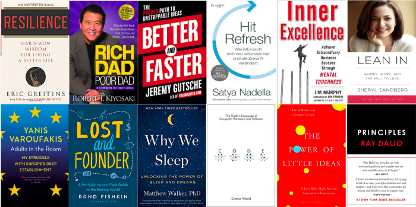

This year I challenged myself to read a book every month and reflecting back on 2018 I wanted to share my recap. Most of my recommendations come from friends and colleagues but I’ve found that Goodreads also has some great recommendations. The goal of this article is to provide a brief Twitter-esque reflection and a rating out of 4 (why 4? because in my opinion it provides a more meaningful indication of whether I enjoyed the book or not). I’ll also provide a list of the books, authors and rating upfront incase you’re only interested in a specific novel. I’m stepping up the goal in 2019 to tackle 15 books and I’m taking suggestions so please feel free to recommend something in the comments!

## The List

- [Resilience — Eric Gretiens (Rating: 3)](https://www.amazon.ca/gp/product/054432398X/ref=as_li_tl?ie=UTF8&tag=robertdippoli-20&camp=15121&creative=330641&linkCode=as2&creativeASIN=054432398X&linkId=d0684fa5a5eaf1810f7a01b5445e93ba)
- [Rich Dad Poor Dad — Robert T. Kiyosaki (Rating:2)](https://www.amazon.ca/gp/product/1612680194/ref=as_li_tl?ie=UTF8&tag=robertdippoli-20&camp=15121&creative=330641&linkCode=as2&creativeASIN=1612680194&linkId=c5773c3707757c835504240676fb9c3e)
- [Better Faster — Jeremy Gutsche (Rating: 3)](https://www.amazon.ca/gp/product/0385346549/ref=as_li_tl?ie=UTF8&tag=robertdippoli-20&camp=15121&creative=330641&linkCode=as2&creativeASIN=0385346549&linkId=e558b1c49cb34fd055cebd42e864b53a)
- [Hit Refresh — Satiyah Nadella (Rating: 3)](https://www.amazon.ca/gp/product/0062652508/ref=as_li_tl?ie=UTF8&tag=robertdippoli-20&camp=15121&creative=330641&linkCode=as2&creativeASIN=0062652508&linkId=9e94c564be5c0176a98ec14886311439)
- [Lean In — Sheryl Sandberg (Rating: 3)](https://www.amazon.ca/gp/product/0385349947/ref=as_li_tl?ie=UTF8&tag=robertdippoli-20&camp=15121&creative=330641&linkCode=as2&creativeASIN=0385349947&linkId=d787be2d1059ddc832821262666d0b69)
- [Inner Excellence — Jim Murphy (Rating: 1)](https://www.amazon.ca/gp/product/0071635041/ref=as_li_tl?ie=UTF8&tag=robertdippoli-20&camp=15121&creative=330641&linkCode=as2&creativeASIN=0071635041&linkId=532358580520ad3106965cf50fb2e114)
- [Adults in the Room — Yanis Varoufakis (Rating: 4)](https://www.amazon.ca/gp/product/1847924468/ref=as_li_tl?ie=UTF8&tag=robertdippoli-20&camp=15121&creative=330641&linkCode=as2&creativeASIN=1847924468&linkId=e4ca3f5defc7fd8a39de08831d665b5f)
- [Lost and Founder — Rand Fishkin (Rating: 3)](https://www.amazon.ca/gp/product/0735213321/ref=as_li_tl?ie=UTF8&tag=robertdippoli-20&camp=15121&creative=330641&linkCode=as2&creativeASIN=0735213321&linkId=3938d1c7ac3caa8f7fb04c06a780bd9d)
- [Why we Sleep — Matthew Walker (Rating: 4)](https://www.amazon.ca/gp/product/1501144316/ref=as_li_tl?ie=UTF8&tag=robertdippoli-20&camp=15121&creative=330641&linkCode=as2&creativeASIN=1501144316&linkId=173d3c48a154d7340344b3d5e00553ac)
- [Code — Charles Petzold (Rating: 2)](https://www.amazon.ca/gp/product/0735611319/ref=as_li_tl?ie=UTF8&tag=robertdippoli-20&camp=15121&creative=330641&linkCode=as2&creativeASIN=0735611319&linkId=51449cde05078169501830ea8272d77e)
- [The Power of Little Ideas — David Robertson & Kent Lineback (Rating: 1)](https://www.amazon.ca/gp/product/1633691683/ref=as_li_tl?ie=UTF8&tag=robertdippoli-20&camp=15121&creative=330641&linkCode=as2&creativeASIN=1633691683&linkId=63c9576b03034c916c8df53203e93487)
- [Principles — Ray Dalio (Rating 4)](https://www.amazon.ca/gp/product/1501124021/ref=as_li_tl?ie=UTF8&tag=robertdippoli-20&camp=15121&creative=330641&linkCode=as2&creativeASIN=1501124021&linkId=18913ed5cc4e23555a3b21c063154c47)

## The Detailed Breakdown

### Resilience — Rating 3

Resilience was a great reflection on the timeless lessons that author Eric Gretiens learned while he completed his basic training as a navy seal. The book takes the form of written letters and reflections to a close friend Zach during training, this friend was an explanatory member of the seals and a great comrade. This friend had an overly difficult time reintegrating back into society after his time with the force, a problem, that many of our veterans face today. I felt like the approach to telling the story was interesting and the lessons learned were applicable to many things in life.

### Resilience — Rating 3

Resilience was a great reflection on the timeless lessons that author Eric Gretiens learned while he completed his basic training as a navy seal. The book takes the form of written letters and reflections to a close friend Zach during training, this friend was an explanatory member of the seals and a great comrade. This friend had an overly difficult time reintegrating back into society after his time with the force, a problem, that many of our veterans face today. I felt like the approach to telling the story was interesting and the lessons learned were applicable to many things in life.

### Rich Dad Poor Dad — Rating 2

I found many of the teachings to be very impactful and perspective changing. Even the simple ideas like the definition of a ‘true asset’ and how it is important to differentiate them from other assets. The author did a good job of explaining each of the lessons, however, his reflection on some of the lessons felt shallow and biased towards his rich dad’s views. The book aggressively challenges the readers views and forces a middle ground. Overall, the book was thought provoking and challenged my beliefs when it came to financial intelligence. Robert’s lessons stuck with me and I found myself reflecting on them frequently with colleagues at work.

### Better Faster — Rating 2

My favourite parts of the book were when Jeremy talked about his own experiences with entrepreneurship. They felt genuine and his personal story is very relatable to many young professionals. At times I felt that the farmer / hunter analogy seemed forced and I noticed some common themes emerged across all of the patterns (i.e. embrace social, go digital). Jeremy has built and scaled an agency that is truly impressive and I am excited to see what future has in store for Trend Hunter.

### Hit Refresh — Rating 3

Hit Refresh felt like an address to employees more than it felt like a book for the general public. Satya explains how he plans to empower employees and reflects on some of the more public litigations since he was named CEO. I appreciate these reflections because I feel like it gives a great insight into what is really happening behind the scenes. Unfortunately, it sounded like it was heavily reviewed taking away a lot of the authenticity. I enjoyed reading about Satya’s rise through the company but would have liked to hear more. Overall, Hit Refresh provides a lens inside one of the biggest tech companies in the world which I found to be incredibly interesting. However, I feel like the lens that lets us inside didn’t come off as authentic and left a lot to be desired.

### Lean in — Rating 3

As a young business and technology professional a lot of what Sheryl described resonated strongly with me. I’ve always acknowledged the facts surrounding gender inequality but I never understood the implications. Sheryl does a fantastic job of not only highlighting the issues but using her personal experiences to contextualize the challenges facing women which made them much more meaningful.

### Inner Excellence — Rating 1

In my experience, the success of this type of book comes from the authors ability to relate the concepts to examples. Jim has done a good job with this drawing on examples from some of the greats like Michael Jordan and Urban Meyer. I did feel as though there was a lot of overlap with the concepts, which I think happens when you try to stretch a framework out to fit into a full length novel. Overall, I thought the frameworks defined in the book were powerful and I will definitely take some of them away and apply them in my life, however, a lot of the book felt like filler and could’ve been captured in a much more condensed version.

### Adults in the Room — Rating 4

Adults in the room is an incredibly fascinating story about the economic situation in Greece and the broader eurozone. The book provided a very interesting view into the economic crisis from Greece’s minister of finance Yanis Varoufakis. I found the inner workings and politics behind how important decisions that shape the future of Europe to be fascinating. I really enjoyed getting to know the different personalities of some of Europes economic powers including Wolfgang Schäuble and Angela Merkel. Varoufakis gives a very candid account of his experience of his time in office and I learned in amazing depth about the Greek economic crisis.

### Lost and Founder — Rating 3

Running a company is difficult. Rand Fishkin runs an SEO company called Moz which was founded in 2004 and is valued at around $40M at the time of publication. The book does an excellent job of dispelling the myths of Silicon Valley. Moz isn’t an Uber or a facebook but it is a successful company none the less and it was interesting to hear Rand’s perspective on what goes into running a company. On the macro level, the book covered raising funding and defining a successful product line. On the micro level, removing people who clash with the company culture and what goes into hiring the right people. Rand is a successful CEO with a fascinating perspective and I think Lost and Founder captures this perfectly.

### Why we Sleep — Rating 4

Why we sleep has changed my perspective on the importance of sleep. Matthew Walker describes why our bodies need sleep and the adverse effects of neglecting sleep over time. It also touches on the social constructs that force people into a sleep deficit ultimately making them more susceptible to disease. It was also interesting to hear about the effects of alcohol on our sleep and short term memory. As someone who generally got 6 hours of sleep prior to this book I challenge myself to get 8 hours for two weeks. The changes (albeit likely due to placebo) were very noticeable in my clarity of thought and overall energy levels and today I try my best to get 8 hours each night.

### Code — Rating 2

Code was a very technical overview of how the first computers were derived from language. The beginning of the book covers some of the history of some influential languages that were tied to the foundations of computer programming (namely, braille and morse code). From there the book focuses on the hardware behind the first computers starting with a simple circuit and eventually to a functioning compute engine. Code read like a textbook which made it difficult at time to stay focused. The timeline and history were both areas that I enjoyed but I ultimately ended up getting bogged down by the technical information as the circuit got more and more advanced.

### The Power of Little Ideas — Rating 1

The power of little ideas discussed the concept of a ‘third way’ which was the 0.5 in the traditional 0 or 1 approach to innovation. The idea behind the third way being that companies do not need to drastically change how they do business to inspire growth. The important thing is select a product and understand how customers extract value. With that understanding, mould the product to optimize that value. I felt that this was another example of a book that was unnecessarily long and didn’t offer much of a deeper understanding from the original thesis.

### Principles — Rating 4

Principles gave a fascinating perspective into the mind of Ray Dalio, billionaire investor, philanthropist and hedge fund manager. I found Ray’s approach to be logical and intense. The principles in the book summarize how Ray has shaped his life and his business (Bridgewater Capital). I found a major cornerstone of Ray’s principles was a disciplined approach to reflection and constantly iterating on how you approach problems. The first half of the novel discusses Ray’s life and business and the second half zeros in on his principles. Typically, these types of self help novels are hit or miss but Principles is incredibly rich in experience and detail and will be something that I reference in the future.
